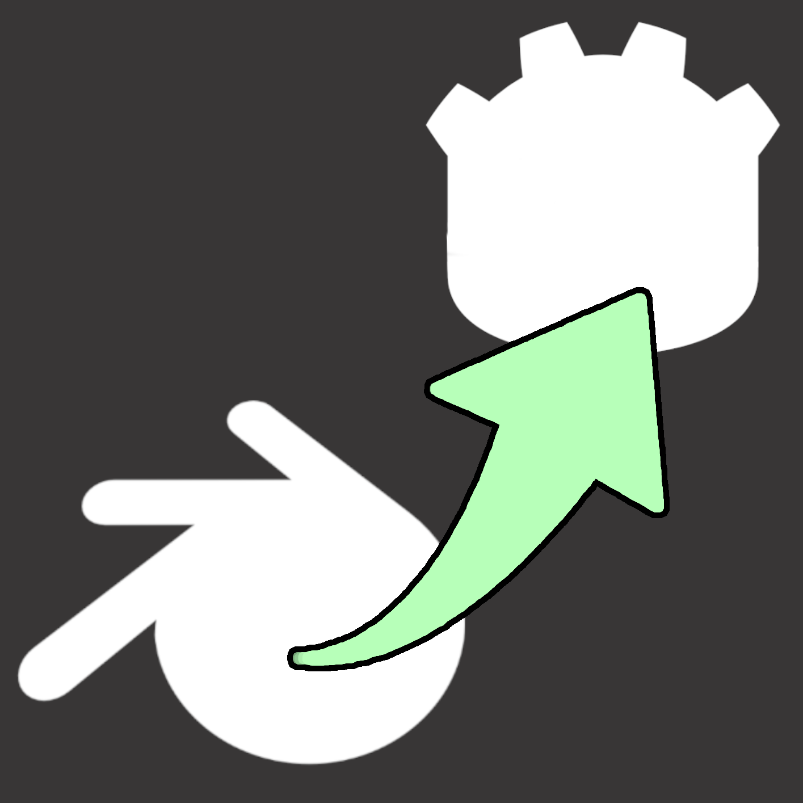

## blender-godot-pipeline

[Youtube video](https://www.youtube.com/watch?v=Igqqg7R-4sA)
 
**Helper Godot 4 addon for my Blender addon which is available on the blender market here.**

[Blender Addon](https://blendermarket.com/products/blender-godot-pipeline-addon)

After installing this addon, you'll have easier access to the **GLTF Import** and **Scene Initialization** scripts:

## Youtube Videos for This Add-on
- [Multimesh setup video](https://www.youtube.com/watch?v=XbhszPsQo-M)
- [Shaders and Materials setup video](https://www.youtube.com/watch?v=P-U7ynJxSdY)
- [Collisions setup video](https://www.youtube.com/watch?v=UuYTZ82f5po)
